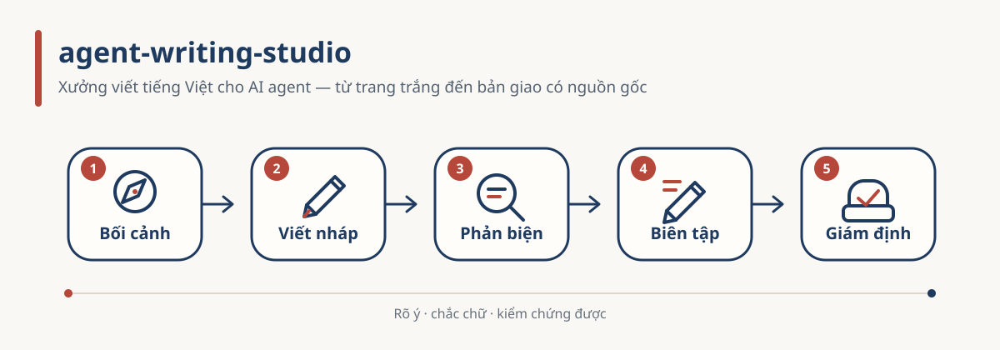

# agent-writing-studio



**English** · [Tiếng Việt](README.vi.md)

**An AI-agent writing studio for Vietnamese prose: from the blank page to an accepted delivery.**

This repository is not an app. It has no buttons and runs on no server. It is **a set of instructions
for AI agents** (Claude Code, Codex, Antigravity) — folders of text files the agent reads and follows.
You install it as an agent plugin (or open the repository folder directly), then talk to the agent in
plain Vietnamese. The studio writes and reviews **Vietnamese**; this page is the English overview.

> **Terms first.** An *agent* is an AI assistant that can read files on your machine and run commands,
> not just chat. A *skill* is a folder with a `SKILL.md` telling the agent **when** to use it and **in
> which order** to work; the agent loads it when the situation matches. The repository is 9 skills (5
> axes in `skills/`, axis 5 holding 4 sub-skills), shared data, and 7 single-step commands.

New here? Read [`GUIDE.md`](GUIDE.md) — one case walked through all five axes.

---

## 1. What it does

Writing a decent piece takes five jobs, and four of them are **not typing**:

| Stage | Name in the repo | What actually happens |
|---|---|---|
| **1. Context** | `01-context-architect` | Interview until the brief, thesis, reader, grader and evidence are real. Anything still open → **stop, do not write**. |
| **2. Draft** | `02-cowriter` | Three-layer outline, **wait for your approval**, then prose — with a machine-written self-declaration of which sentences the machine wrote. |
| **3. Critique** | `03-critique` | Score each criterion separately against the genre rubric, look for fallacies and unsupported claims. **No total score** — a total hides the weak spot. |
| **4. Humanize** | `04-humanizer` | Edit toward the author's own voice. Never add or drop a fact, never change how strong a claim is. |
| **5. Audit** | `05-forensics` | Read the text, point at passages with signs of AI writing, each with a counter-explanation and a question to verify. |

The five stages are the **Y axis**, run in order. An exam essay and a novel chapter are not graded the
same way, so the genre-specific part lives on the **X axis**: each genre is **one data file** in
`shared/genres/`, not a separate skill. Nine genre profiles ship today (`essay`, `research`, `blog`,
`journalism`, `novel` are `full`; `commentary`, `thesis-proposal`, `internship-report`,
`teaching-initiative` are `partial` — audit section only). See [`docs/GENRES.md`](docs/GENRES.md).

Axis 5 routes to four sub-skills inside `skills/05-forensics/`: `05a-reading` (blind sentence
labelling), `05b-scoring` (S and C after the reading is locked), `05c-reporting` (Vietnamese report),
`05d-calibration` (reference corpus and false-positive rate).

**Do not use this repository** to accuse anyone of cheating, or to "beat AI detectors". Section 5 of
the Vietnamese README explains why both are hard limits, with the measurement behind them.

---

## 2. Install

The easiest path: paste the prompt at the end of [`INSTALL.md`](INSTALL.md#prompt-copy-dán) into your
AI app and let the agent do the steps. Works on **Windows and macOS** (Linux should work, untested).

**Claude Code — install the plugin:**

```bash
claude plugin marketplace add ducnguyen221/agent-writing-studio
claude plugin install agent-writing-studio@agent-writing-studio
```

The plugin carries the **whole repository tree** (skills, `/agent-writing-studio:*` commands, shared
data), so nothing is copied by hand. Codex, Antigravity, Claude Desktop: see [`hosts/`](hosts/README.md).

**Clone to develop, or to run from a checkout:**

```bash
git clone https://github.com/ducnguyen221/agent-writing-studio
cd agent-writing-studio
python studio.py doctor        # macOS: python3.12 studio.py doctor
```

`studio.py` needs Python 3.10 or newer and only the standard library. It has five subcommands:
`doctor` (check, change nothing) · `install` (create the data folder, **print** host registration
commands) · `update` (`git pull --ff-only`, refuses a dirty checkout) · `uninstall` (print removal
commands, never delete data) · `migrate` (rename the pre-0.4.0 `.work/` folder, see below). It never
edits host configuration itself.

Optional libraries add machine measurement and Word export — `pip install underthesea python-docx
pymupdf jsonschema pyyaml` — but the studio runs without them. Problems: [`docs/troubleshooting.md`](docs/troubleshooting.md).

---

## 3. Where your data lives

The five axes talk through **files**, never through chat memory. Each piece of writing has a **case
folder**. With no variable set, the **default workspace** is `workspace/<case>/` inside the folder you
opened — for a clone that is `<repo>/workspace/`, ignored by Git. A plain user needs nothing else:
no environment variable, no extra folder.

Optional: keep data outside the clone (several machines or checkouts) in a **station** pointed to by
`WRITING_STUDIO_DATA`, then run `python studio.py install` to create `work/`, `out/`, `corpus/`:

```powershell
setx WRITING_STUDIO_DATA "$HOME\.writing"     # Windows — open a new terminal afterwards
```

```bash
export WRITING_STUDIO_DATA="$HOME/.writing"    # macOS/Linux — add to ~/.zshrc, open a new terminal
```

A personal **knowledge base** (voice profile, the author's own sample texts, reader personas) is also
optional: set `WRITING_STUDIO_KNOWLEDGE` to its root. Axis 1 only **points** into it from
`context.json`; nothing is copied into the repository. No variable set means no knowledge base — no
folder in your home directory is guessed.

### Upgrading from 0.3.x: `.work/` → `workspace/`

Version 0.4.0 renamed the default workspace from `.work/` to `workspace/`, like the sibling studios.
Nothing moves by itself and nothing is lost:

1. While only `.work/` exists, the studio keeps reading it; `doctor` reports `data WARN`.
2. `python studio.py migrate` shows the plan (dry run). `python studio.py migrate --yes` renames the
   folder in one step and writes a journal `workspace/.studio-migrate.json`.
3. `python studio.py migrate --undo --yes` puts it back.
4. If **both** folders exist, `doctor` reports `FAIL` and `migrate` refuses — decide which to keep;
   see [`docs/troubleshooting.md`](docs/troubleshooting.md).

`WRITING_STUDIO_DATA` still wins over both folders. The old knowledge variable from before 0.3.0 is no
longer read — set `WRITING_STUDIO_KNOWLEDGE` (see [`CHANGELOG.md`](CHANGELOG.md)).

---

## 4. Commands

Seven single-step commands in `commands/`, namespaced `/agent-writing-studio:<command>` in Claude Code
(other hosts read the files directly). A command does **one step**; if the previous step's file is
missing it says which command produces it instead of re-running the chain.

| Command | Axis | Needs | Writes |
|---|---|---|---|
| `01-context` | Y1 | — | `context.json` |
| `02-draft` | Y2 | `context.json` | `draft.md` · `draft.meta.json` · `sentences.json` |
| `03-critique` | Y3 | `draft.md` · `sentences.json` | `critique.json` |
| `04-humanize` | Y4 | `draft.md` · `sentences.json` | `polished.md` · `polish.diff.json` · provenance sidecar |
| `05-audit` | Y5 | text · `sentences.json` | `evidence.json` · `report.md` |
| `deliver-docx` | delivery | `polished.md` | `<name>.docx` + sidecar |
| `list` | — | — | prints this table, read live from `commands/` |

Three hard gates: Y1 with open questions → stop and ask; Y2 without an approved outline → no prose;
Y4 that added or dropped a fact → return the original.

---

## 5. Integrity, in one paragraph

The studio both **writes** (axes 2 and 4) and **audits provenance** (axis 5) with **the same catalogue
of tells**, so text that went through the studio scores `low_signal` under a blind audit *by
construction* — that is an identity, not evidence of human authorship. Integrity therefore comes from
**provenance that travels with the deliverable** (`draft.meta.json`, `polished.provenance.json`), not
from a detector score. No output is enough to discipline a person; every finding carries a
counter-explanation. Full discussion, numbers and sources: [README.vi.md §5](README.vi.md).

---

## 6. Repository map

```
agent-writing-studio/
├─ README.md / README.vi.md   this overview (English / Vietnamese, the Vietnamese one is fuller)
├─ GUIDE.md / GUIDE.vi.md     one case through all five axes
├─ INSTALL.md                 install guide for agents + copy-paste prompts
├─ START-HERE.md              first exercise after installing
├─ AGENTS.md                  canonical agent instructions (CLAUDE.md, GEMINI.md point here)
├─ studio.py                  doctor · install · update · uninstall · migrate
├─ NOTICE · provenance.json   third-party data and libraries, with licenses
├─ skills/                    five axes, nine skills — the single source the plugin loads
├─ commands/                  seven single-step commands
├─ shared/                    genres · rules · schemas · scripts · writer schemas
├─ hosts/                     per-app install notes
├─ samples/                   a synthetic sample case, checked offline by doctor
├─ docs/                      ARCHITECTURE · SCORING · GENRES · troubleshooting · original vision
└─ tests/                     structure, data shape, links, public-boundary gates
```

Tests are for people changing the repository (Python 3.10+; CI runs Windows and macOS on 3.10, 3.12,
3.13): `pip install -r requirements-dev.txt`, then `python -m pytest tests -q` and
`python -m unittest discover -s tests -t .` — both runners must agree. See [`tests/README.md`](tests/README.md).

---

## 7. License and credits

MIT — see [`LICENSE`](LICENSE). Third-party data and optional libraries: [`NOTICE`](NOTICE) and
[`provenance.json`](provenance.json). The idiom list in `skills/04-humanizer/assets/idioms.json` is
MIT-licensed data whose copyright and permission notices must stay in that file. How to cite:
[`CITATION.cff`](CITATION.cff). Author: Nguyễn Quang Đức · [ducnguyen.vn](https://ducnguyen.vn).
